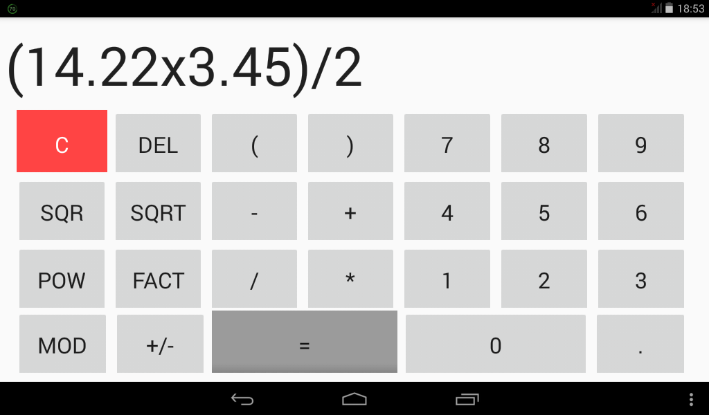
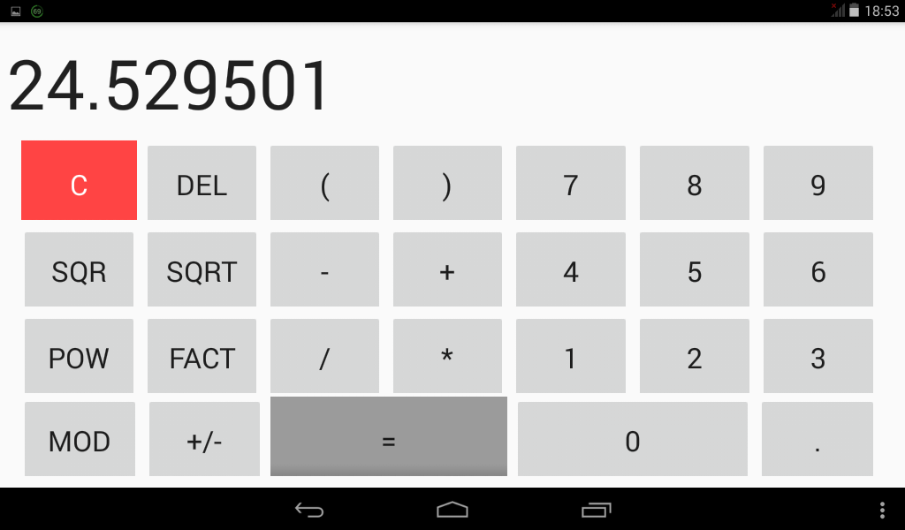
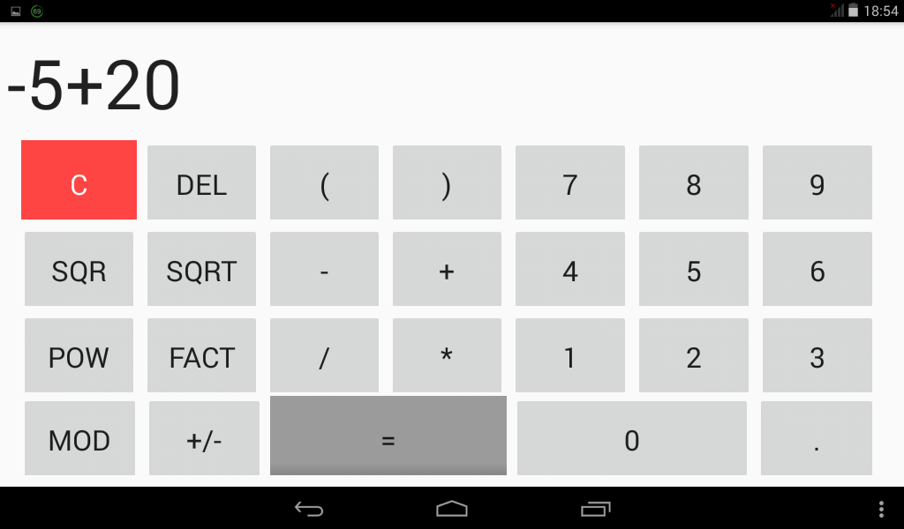
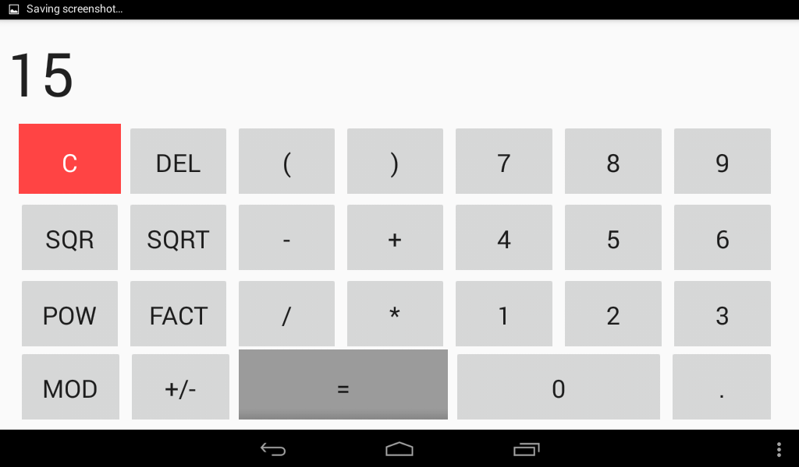
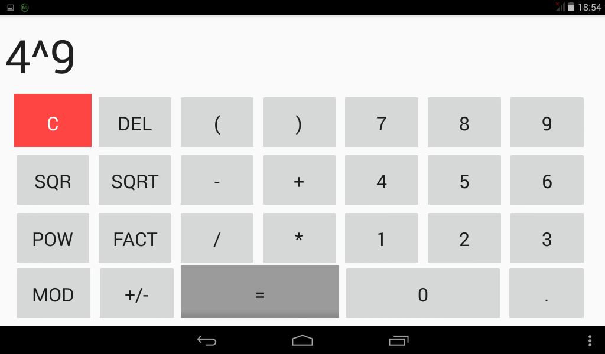

# Android-Calcululator
An advanced calculator written in <b>Java</b> using <b>Android Studio</b>.

The calculator is capable of handeling:
* Formulas with <b>multiple operators</b>
* Formulas with <b>multiple parentheses</b>
* <b>Floating numbers</b>
* <b>Square</b> operation
* <b>Root Square</b> operation
* <b>Power</b> operation
* <b>Factorial</b> operation
* <b>Modulo</b> operation

